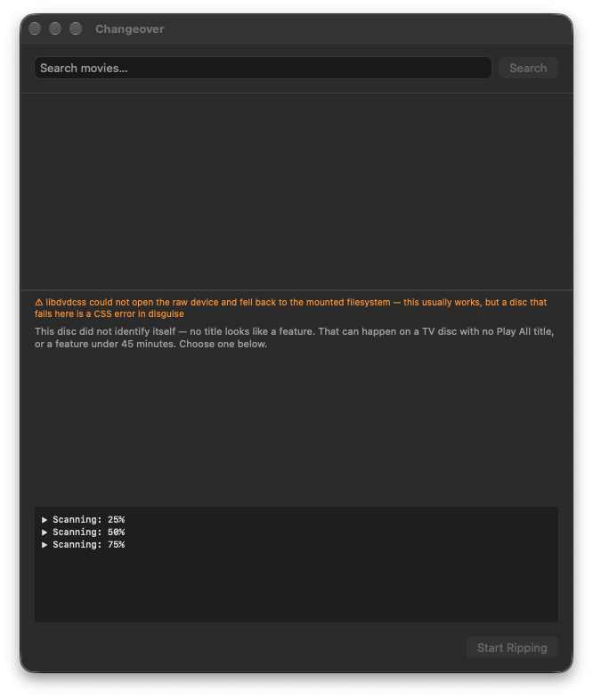

# 0039 — A scan that returns zero titles is reported as "this disc did not identify itself", with an empty picker and no way forward

| | |
|---|---|
| **Status** | open |
| **Phase** | 2 — Choose what gets ripped |
| **Module** | DiscScanner / DiscTitleListView / JobController |
| **Platform** | macOS |
| **First seen** | 2026-09-16 |

## Description

Found on joe during the first real-disc run (Oppenheimer, 2026-09-16). The app scanned the disc, showed the orange warning "libdvdcss could not open the raw device and fell back to the mounted filesystem", and then said:

> This disc did not identify itself — no title looks like a feature. That can happen on a TV disc with no Play All title, or a feature under 45 minutes. Choose one below.

Below it was **nothing**: the title table was empty, so there was nothing to choose, and Start Ripping stayed disabled with no explanation.

The disc is fine. Running the app's own command from a shell on joe reports the feature correctly:

```
HandBrakeCLI -i /Volumes/OPPENHEIMER --scan --title 0 --min-duration 1 --json
→ MainFeature: 7, 8 titles; title 7 = 3:00:11, 21 chapters, 3 audio, 6 subtitles
```

So the app's scan came back with **zero titles**, and `DiscTitleHeuristic.classify` correctly returned `.none` for an empty disc. The defect is that a zero-title scan is presented as "no title looks like a feature", which is a statement about the *contents* of a disc that was in fact never read.

**Root cause, confirmed 2026-09-16 (not permissions).** `ProcessRunner.run` feeds the child's stdout **and stderr into one pipe**, so HandBrake's log lines interleave with its JSON. On this disc the splice lands inside a JSON value:

```
"KeepDuplicateTitles": falseHandBrake has exited.
,
```

`HandBrakeScanParser.parseTitleSet` brace-matches the block, `JSONSerialization` then fails, and the parser returns an empty `DiscInfo` with `mainFeatureIndex == nil`. `DiscScanner` sees exit 0 **and** the `JSON Title Set:` marker, so its "incomplete scan reports success" guard passes and the empty disc is reported as a success. `DiscTitleHeuristic.classify` then correctly returns `.none`.

Captures are committed as `ChangeoverTests/Fixtures/handbrake-scan/oppenheimer-title0-min1-merged.txt` (stdout+stderr, reproduces the failure) and `oppenheimer-title0-min1.json` (stdout only, parses to 8 titles, `MainFeature: 7`). The existing Dragon Tattoo fixture is stdout-only, which is why no test caught this.

The same interleaving can corrupt any scan; this disc just makes it likely, because retrieving CSS keys makes HandBrake chatty while the JSON is being written.

## Expected behavior

- A scan that exits 0 but yields no titles is reported as what it is: "The scan read no titles from this disc", with HandBrake's own last error line, a Rescan button, and — when the warning names the libdvdcss/raw-device fallback — a hint that the app may lack permission to read the disc (Privacy & Security → Files and Folders / Full Disk Access).
- The `.none` message ("no title looks like a feature… Choose one below") is used **only** when titles exist and none clears the bar.
- A picker is never shown empty with an invitation to choose from it.

## Actual behavior

Zero titles are folded into `.none` and rendered with an invitation to choose from an empty table. Start stays disabled with no reason given.

## Plan

**Part 1 — stop corrupting the JSON (the actual bug).**

- Read stdout and stderr as **separate streams** in `ProcessRunner` (its header says it wires "one pipe exactly as both current callers do"), and parse the scan's JSON from stdout only. Keep stderr for `DiscScanner.classify`'s warnings, which is where the libdvdcss line comes from, and for failure text.
- `EncodeController`'s progress parsing reads HandBrake's stderr today through the same merged stream — its behaviour must not change. Whatever shape the split takes, both callers keep working.
- Regression-test with the committed merged capture: parsing `oppenheimer-title0-min1-merged.txt` the old way fails, and the new stdout/stderr split yields 8 titles and `MainFeature: 7`. Assert the stdout-only fixture parses to the same thing.
- Consider a belt-and-braces parser guard: if the brace-matched block fails to decode, report a parse failure rather than an empty `DiscInfo`, so a corrupt scan can never again look like a disc with no titles.

**Part 2 — never present an empty scan as a judgement about the disc.**

- `DiscTitleHeuristic.Outcome` (or the view's switch over it) gains a distinct empty case, e.g. `.noTitles`, so "the scan read nothing" and "nothing looks like a feature" can never render the same way. A pure function, unit-tested with an empty `DiscInfo`.
- `DiscTitleListView` renders `.noTitles` as a failure-shaped state: the message, the scan's warnings/last stderr line, and the existing Rescan button. No table.
- Carry the tail of HandBrake's stderr (or its classified warning) on `DiscScanner.Result` so the reason can be shown. `HandBrakeFailureClassifier` may already name this case; reuse it rather than adding a second vocabulary.
- When the libdvdcss raw-device fallback warning is present **and** zero titles came back, add the permissions hint, worded as a possibility, not a diagnosis.
- Check `#0024`'s claim that a failed scan and a disc with no titles can't look identical — that exit-status rule holds, but the zero-title success path was never surfaced to the user. Update that issue's notes if needed.
- Regression-test the parser against the real capture committed here (`0039/handbrake-scan-stderr.txt` is the stderr; the JSON stdout capture should be added as a fixture under `ChangeoverTests/Fixtures/handbrake-scan/oppenheimer-title0-min1.json`) and assert it yields 8 titles and `MainFeature: 7`. That pins "the parser is not the problem".

## Attachments




## Notes

Not yet established, and worth settling while the disc is in the drive: whether granting Changeover Full Disk Access (or Removable Volumes) on joe makes the app's own scan return the same 8 titles. If it does, the app should also ask for that access up front rather than after a failed scan — that would be its own issue, in the Phase 6 first-run block.

## Relation

- Related: [#0024](0024.md) — scan success/failure classification.
- Related: [#0026](0026.md) — the picker and its outcome rendering.
- Related: [#0025](0025.md) — `classify` returning `.none` for an empty disc is correct; the presentation is not.
